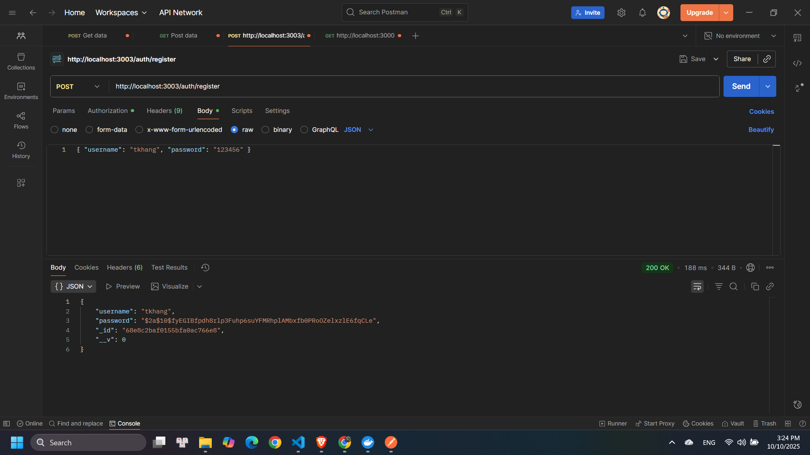
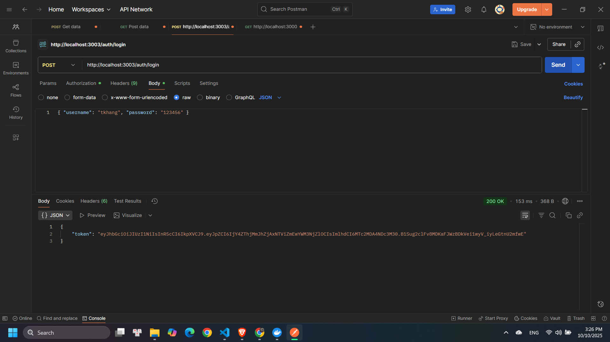
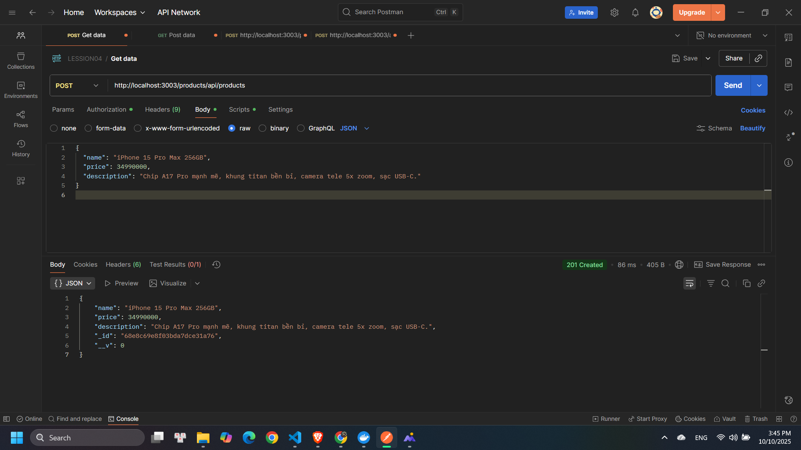
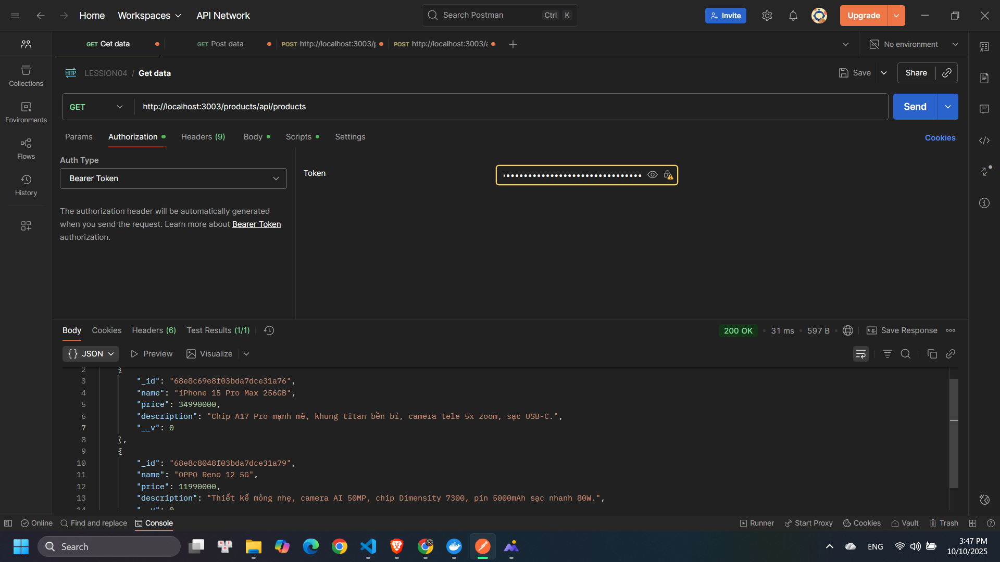
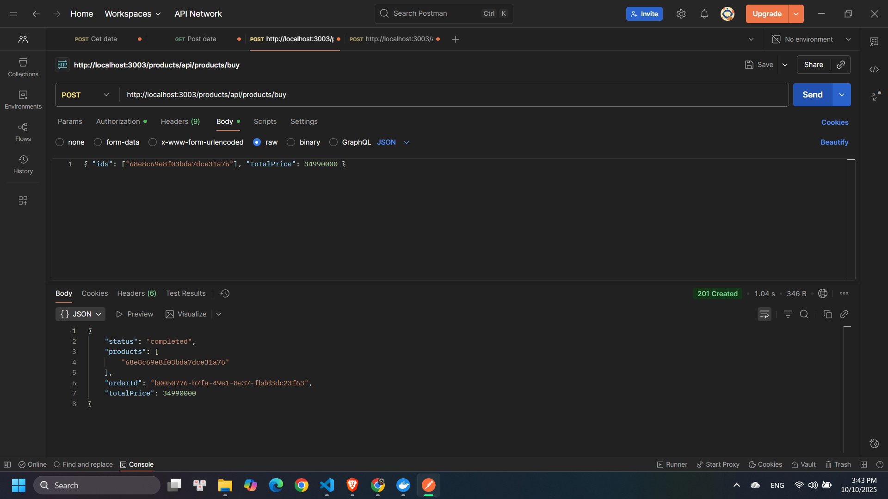
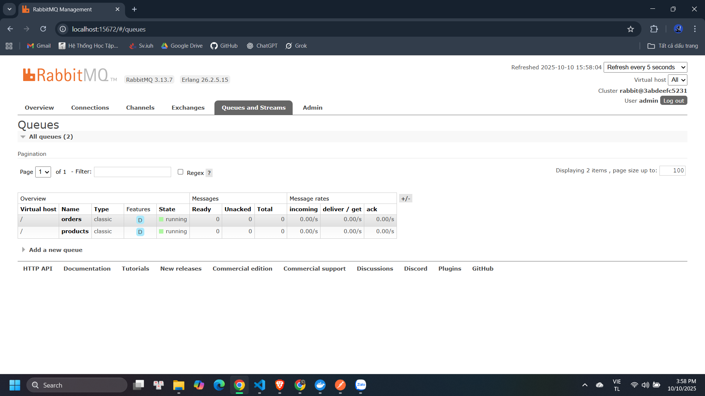

Hệ thống bao gồm nhiều dịch vụ nhỏ (services) hoạt động độc lập, giao tiếp với nhau thông qua **API Gateway** và **message broker (RabbitMQ)**.  
Các dịch vụ chính:

- **Auth Service** – xử lý đăng ký, đăng nhập, xác thực người dùng.
- **Product Service** – quản lý danh mục, thêm/sửa/xóa sản phẩm.
- **Order Service** – xử lý đặt hàng, lưu trữ đơn hàng của người dùng.
- **API Gateway** – định tuyến request đến đúng service.
- **RabbitMQ** – dùng để truyền thông tin bất đồng bộ giữa các service.
  
## Test all business logic with POSTMAN
###  Đăng ký người dùng

###  Đăng nhập người dùng

---

## Product Service

### Thêm sản phẩm

###  Lấy danh sách sản phẩm

---

##  Order Service

###  Đặt hàng sản phẩm

---

##  RabbitMQ Service

Hệ thống sử dụng **RabbitMQ** để giao tiếp giữa các service (Pub/Sub model):

---

##  Công nghệ sử dụng

- **Node.js / Express.js**
- **MongoDB**
- **RabbitMQ**
- **Docker**
- **JWT Authentication**
- **RESTful API**
